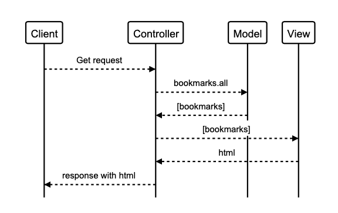

# README

## User Stories

>As a User, I should be able to see a list of bookmarks.

>As a User, I should be able to add the sites address and title to bookmark manager.

>As a user, so I can remove my bookmark from Bookmark Manager, I want to be able to delete a bookmark.

>As a user, so I can change a bookmark in Bookmark Manager, I want to update a bookmark.

## Domain Model



## Database Setup

1. Connect to 'psql'

2. Create database using 'psql' command:
```
CREATE DATABASE bookmark_manager;
```
3. Connect to newly create database:
```
\c bookmark_manager;
```
4. Run scripts in 'db/migrations' directory in order.

## Testing Database Setup

1. Connect to 'psql'

2. Create database using 'psql' command:
```
CREATE DATABASE bookmark_manager_test;
```
3. Connect to newly create database:
```
\c bookmark_manager_test;
```
4. Run scripts in 'db/migrations' directory in order.